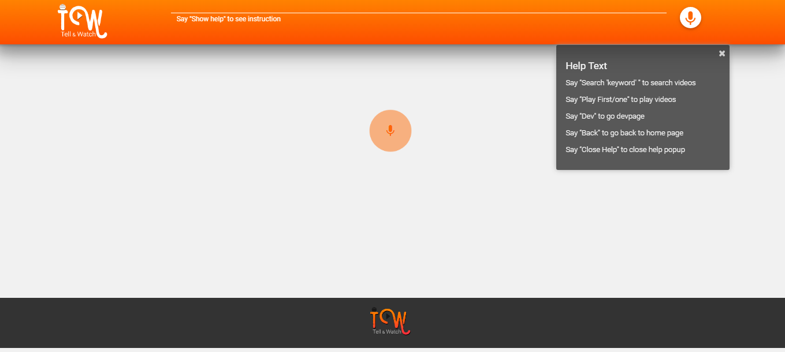
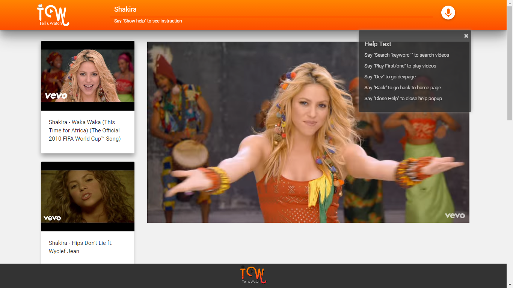
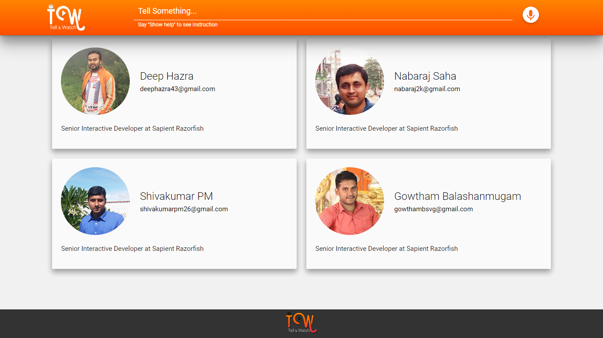

## Tell and Watch: The assistant app for search youtube videos by speech



 

Above are the snapshots of the Tell-and-watch home page & UI view respectively.And play option to watch the desired video.

## Description

The application will help user to search the youtube videos through speech recognition. The web application developed on top of javascript speech recognition. The listed out videos can be played by saying the video order and next videos can be searched even when other videos are playing.

# README FIRST

## How to use the app

Go the [https://tell-and-watch.firebaseapp.com](https://tell-and-watch.firebaseapp.com)  on your phone or computer. You can ask app the following questions:

- Say `Search * `: App will search videos from Youtube and list it down.
- Say `Play * (First/one/second/two...) `: Asking app which video to be played.
- Say `Search * `: New videos still can be searched in between video is playing.
- Say `Dev info `: Redirect to page where Informations of developers spent their time to create a app.
- Say `Back * `: Redirect the page from Dev info to seach if user is landed in Dev info.
- Say `Show Help `: instructions will be showed in popup.
- Say `Close Help `: Hide instructions popup.

## Built With

```
- Angular 4 + dependencies
- Typescript
- Webpack + dependencies
- Material Design Lite + Material Design Icons
- Annyang.js
- Youtube API
- Toastr
- Firebase for deployment
```
## local devs

```bash
$ # 1) This page assumes that you have already cloned the repository and executed the following commands
$
$ npm install
$
$ # 2) use this command to serve your local dev in your browser (with livereload support)
$
$ npm serve
$
$ # 2.1) push your updates to git (as usual, with your favorit tool)
$
$ # 3) when ready, build the browser version of the app using the angular-cli
$
$ ng build
$
$ # 4) commit all updates to git (with your favorite tool)
$
$ # 5) push the created tag to git
```

## Deploying in firebase

```
$ firebase deploy
```

## Access the `https` deployed app (not http)

```
https://tell-and-watch.firebaseapp.com
```
## The team

- Gowtham Balashanmugam ([gowthambalashanmugam](https://github.com/gowthambalashanmugam))
- Nabaraj Saha ([nabaraj](https://github.com/nabaraj))
- Shivakumar ([shivakumarpm](https://github.com/shivakumarpm))
- Deep Hazra ([deep43](https://github.com/deep43))
